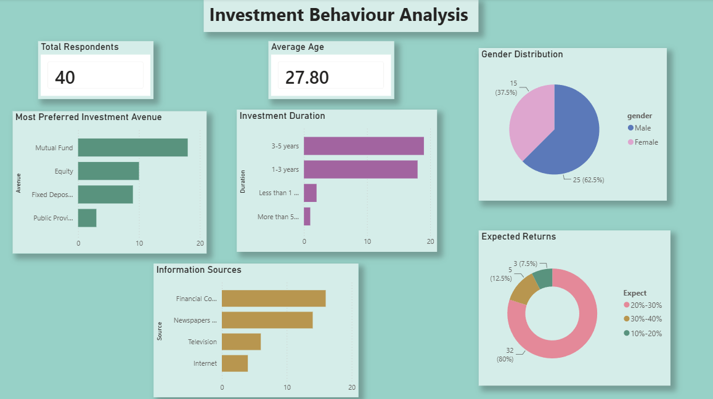

# Investment Behaviour Analysis

## Overview
Analysis of investment behaviour and preferences of 40 survey respondents 
using Python and Power BI.

## Tools Used
- Python (Pandas, Matplotlib, Seaborn)
- Power BI

## Dataset
- 40 respondents, 24 columns
- Covers investment avenues, savings objectives, 
  expected returns, information sources

## Key Findings
- Mutual Funds is the most preferred investment avenue (45%)
- 80% of respondents expect 20%-30% returns
- Average investor age is 27.8 years
- Financial Consultants are the top information source (40%)
- Most respondents plan to invest for 3-5 years (47.5%)

## Dashboard Preview

## Tasks Completed
- Data Overview & Structure
- Gender Distribution Analysis
- Descriptive Statistics
- Most Preferred Investment Avenue
- Reasons for Investment
- Savings Objectives
- Common Information Sources
- Investment Duration Analysis
- Return Expectations
- Correlation Analysis
